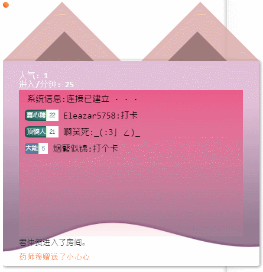
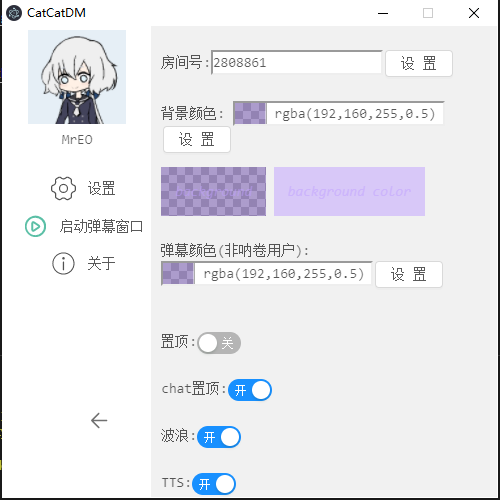

# catcatDM

> catcatDm! The meta-electron-catcat-bilibili-danmu application!

### 说明
喵喵酱牌 哔哩哔哩 直播弹幕姬（没有直播功能 只能看弹幕！）

- 发送弹幕需要设置 SESSDATA(SESSDATA) 与 csrf(bili_jct)，登陆哔哩哔哩后 F12 复制cookies中的 SESSDATA 与 bili_jct 对应键值

>dom版
 - 
 - 

- [下载地址](https://github.com/kokolokksk/mua/releases/latest)

#### 待做列表
- [x] 显示一条文字
- [x] 动起来
- [x] 对接直播间
- [x] 自定义房间号
- [x] 粉丝牌（包含颜色）
- [x] 背景颜色自定义
- [x] 弹幕颜色
- [x] 人气
- [x] TTS欢迎礼物
- [x] 进入直播间 
- [x] 礼物(基本显示)
- [x] 发送弹幕
- [ ] 发送弹幕更多选项
- [ ] [弹幕统计](https://github.com/kokolokksk/catcat-dm-data)
- [ ] [增量更新](https://github.com/kokolokksk/lolidate)
- [ ] [使用更加好听的TTS](https://github.com/kokolokksk/catcat-tts)

#### 下一步
- TTS service

### 感谢（Thanks）
- npm module [electron-referer](https://github.com/akameco/electron-referer)
- npm module bilibili-live-ws
- npm module [bilibili-live-danmaku-api](https://github.com/simon300000/bilibili-live-danmaku-api)
- [background image](https://codepen.io/plavookac/pen/QMwObb)
- This project was generated with [electron-vue](https://github.com/SimulatedGREG/electron-vue) using [vue-cli](https://github.com/vuejs/vue-cli). Documentation about the original structure can be found [here](https://simulatedgreg.gitbooks.io/electron-vue/content/index.html).

### 交流
issue 或者 qq群（319833969）
