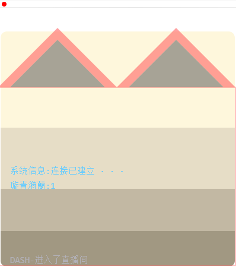

# muamuamua

> muamuamua!



#### TODO
- [x] 显示一条文字
- [x] 动起来
- [x] canvas刷新逻辑
- [x] 对接直播间
- [x] 自定义房间号
- [x] 背景颜色自定义
- [ ] 背景动画
- [ ] 弹幕字体
- [x] 弹幕颜色
- [ ] 弹幕滚动速度
- [x] 人气
- [ ] TTS
- [x] 进入直播间 
- [ ] 关注UP
- [x] 礼物(基本显示)
- [ ] super chat
- [ ] 通过chat 窗口回复
#### NEXT TODO
TTS


> An electron-vue project

#### Build Setup

``` bash
# install dependencies
npm install

# serve with hot reload at localhost:9080
npm run dev

# build electron application for production
npm run build


# lint all JS/Vue component files in `src/`
npm run lint

```

---
> Thanks
This project was generated with [electron-vue](https://github.com/SimulatedGREG/electron-vue) using [vue-cli](https://github.com/vuejs/vue-cli). Documentation about the original structure can be found [here](https://simulatedgreg.gitbooks.io/electron-vue/content/index.html).

npm module bilibili-live-ws